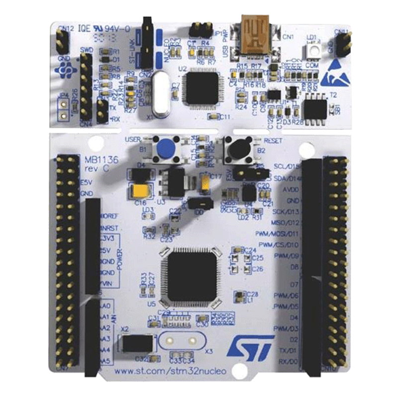
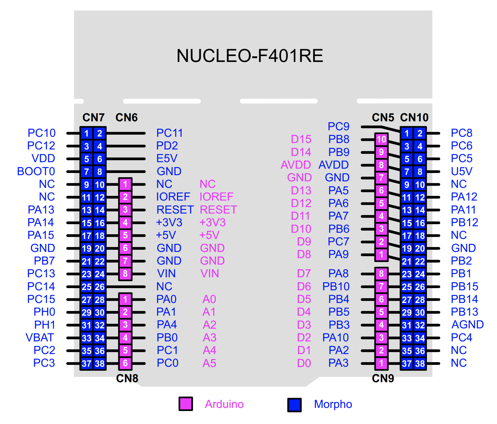
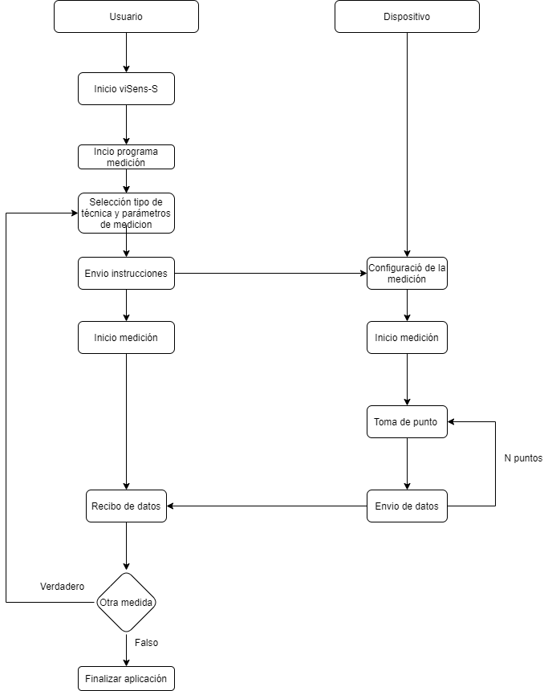
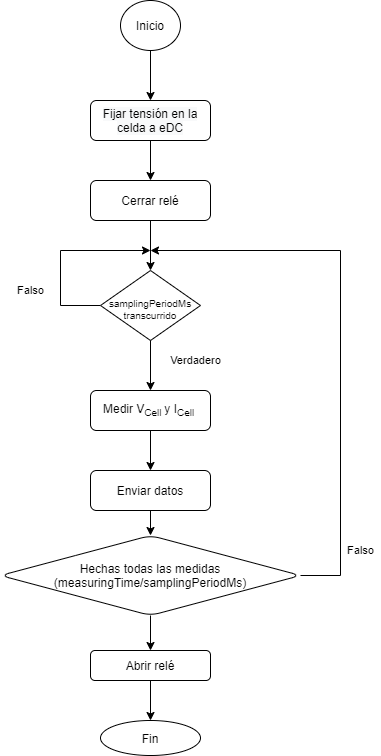

# Final Project Microcontrollers - Configuration of a potentiostat

This project has been developed in the subject of **Microcontrollers for Biomedical Applications and Systems**, from the Biomedical Engineering Degree at the University of Barcelona (UB). It has been carried out by the **BlauGrana** group, formed by Julia meca (left) and Raimon Casamitjana (right), and with the help of our professor Albert Álvarez, to whom we are very grateful. :yum: 

    
    

> **Figure 1:** Julia Meca (left) and Raimon Casamitjana, authors of this project. 

In this document you will find the necessary contents to carry out and understand the project, which consists on the **configuration of a microcontroller to perform electrochemical tests using a potentiostat**.  From the programming code we have developed, chronoamperometries and cyclic voltammetries can be performed in an automatized way.

## Contents

- [Introduction](#introduction)
  - [Potentiostat](#potentiostat) 
  - [Chronoamperometry](#chronoamperometry) 
  - [Cyclic voltammetry](#cyclic-voltammetry) 
- [Goals of the project](#goals-of-the-project)
- [Software and Hardware](#software-and-hardware)
- [Front-end modules](#Front--end-modules)
- [Git and GitHub](#git-and-github)
  - [Development branches](#Development-branches)
- [Procedure](#procedure)
  - [Pinout](#pinout)
  - [Flow diagrams](#flow-diagrams)
    - [viSens-S and the communication](#viSens-S-and-the-communication)
    - [Chronoamperometry](#chronoamperometry) 
    - [Cyclic voltammetry](#cyclic-voltammetry) 
- [Results](#results)
- [Conclusions](#conclusions)
- [References](#references)

## Introduction

Within the Blaugrana team, Júlia Meca and Raimon Casamitjana have carried out the project documented in this report. This has been developed in the framework of the last course of Biomedical Engineering, in the subject of Microcontrollers for Biomedical Applications and Systems. In a nutshell, the project is based on the programming of a potentiostat. More specifically, this consists of a *front-end* properly designed for use in the project, as well as a *back-end* composed of the **STMelectronics NUCLEO-F410RE** evaluation board.

### Potentiostat

A potentiostat is an instrument widely used in electrochemical experiments such as potentiometry, an analytical method that **measures the potential difference between electrodes immersed in a solution.** In these experiments, a source of constant potential difference is required: the potentiostat, which controls the voltage at one or more **working electrodes** with the help of a **reference electrode** and an **auxiliary electrode**.

The electrodes must be in direct contact with the substance to be tested, but they must not interfere with the chemical process, otherwise the test would not be valid. In addition, the size of the electrodes affects the amount of current passing through them, so it must be meticulously designed. 

Regarding its operation, the potentiostat is in charge of measuring and controlling the potential of the electrochemical cell, detecting changes in its resistance (R) and varying the intensity of the current administered (I) to the system according to these fluctuations, so that the potential difference remains constant. 

### Chronoamperometry

Chronoamperometry (CA) is a type of electrochemical measurement based on subjecting a **working electrode** to an instantaneous potential change, usually by means of a **step signal**. In this way, the response of the current or intensity of the electrochemical cell can be studied over time. 

This technique is commonly used to obtain a determined activity of a biological species given the quantification of an analyte of interest in the form of an intensity signal. 

**ACABAR TMB**

### Cyclic Voltammetry

Voltammetry is an electrochemical technique that consists on applying an electric potential to a **working electrode**, which is immersed in a solution containing an electro-active species. Then the current intensity (I) flowing through the electrode is measured. 

**Cyclic voltammetry**, on the other hand, is used to study reaction mechanisms such as redox processes. The variation of potential at a **stationary electrode** is caused by a triangular-shaped signal that reverses and returns to its original value, giving rise to the typical shape of the CV:

fotooooooo

**ACABAR, m’ha fet mandra sorry**

## Goals of the project

The objective of the project is to obtain concentration measurements in samples of **potassium ferricyanide** at different concentrations of a **potassium chloride** buffer. We have left some links to go deeper into these chemical compounds. These electrochemical measurements are based on the 2 types previously described: chronoamperometry and cyclic voltammetry. 

Therefore, the objectives can be summarized as follows: 

- Program a potentiostat using the STM-32 Núcleo 64 Evaluation Board.
- To perform a measurement using cyclic voltammetry (CV).
- To perform a measurement using chronoamperometry (CA). 
- Control the power management unit (PMU) of the *front-end* module. 
- To communicate with the **viSens-S** application using the **MASB-COMM-S** protocol.

In addition, certain specific requirements have to be fulfilled for the correct implementation. As far as the PMU is concerned, it must be started at the beginning of the measurement and not be disabled again. Moreover, the communication must be done with the host by means of an **asynchronous communication with 115200 8N1** configuration. The types of configuration as well as their parameters and meaning can be found in this link. The encoding of the information must also be done in **COBS**, where the character 0x00 implies the completion of the message to be sent. As for the microcontroller and its function, it must act as a slave of the master, and follow the instructions on the measurements to be made reflected in the **MASB-COMM-S** protocol. Also, when the corresponding instruction is sent, the microcontroller must start the measurement. 

Another aspect to take into account is when a measurement is not being taken. In that case, the relay of the *front-end* circuit that connects to the *Counter Electrode* (CE) must remain open. 

As for the programming in the STM environment in particular, this has been done in such a way that 2 functions setup and loop are created in order to simplify the code and thus free the main execution file `main.c`.

## Software and hardware

As discussed in previous sections, the project is based on a measurement *front-end* as well as the control *back-end*. For this reason, both hardware and software are vital for the development of the project and its proper programming. 

As far as the microcontroller is concerned, its programming is of crucial importance given its essential role in the communication and control of the potentiostat as well as for the reception of measurement instructions, data and its pertinent sending. The STM32F4021 Núcleo-64 board has been used for this project, so its programming has also been carried out with its relevant software in C language: **STM32CubeIDE.**. 

The STM board has incorporated certain peripherals, which have been used for the realization of this project. They are the case of the `USART` peripheral, for the communication with the *host* (the *viSens-S* application), and of I2C for the communication with the *front-end* DAC at the time of establishing its output voltage and polarizing the cell. Also noteworthy is the use of digital outputs to open/close the relay as well as to activate the PMU. Finally, the use of the microcontroller's ADC takes a leading role in reading the voltage and determining the cell current. 

The project also revolves around the *viSens-S* desktop application (which can be found at this link). Its function is to send the relevant instructions to perform the measurements, as well as the receipt of the data and its corresponding visualization. Here you can find a video showing the application in more detail. Since the tests could not be performed directly in the cell, the use of a potentiometer on the board has been key to determine the correct operation of the implemented communication and the taking of measurements. By means of its voltage divider and the connection of its variable terminal to the analog input of the microcontroller, it has been possible to verify the correct operation of the system. 

## *Front-end* modules

This section explains in more detail the components of the *front-end* of the potentiostat controlled by the microcontroller and their function. This is essential in order to be able to implement the programming in detail, and to take into account some of the formulas for certain variables of the prototypes used. 

* **Power Management Unit (PMU)**

## Git and GitHub

To carry out projects based on team code development, there are two very useful tools: Git and GitHub. **Git** is a version control system (VCS) while **GitHub** is a website that provides an infrastructure to the Git server and hosts all its repositories, as well as different tools to work with them. 

A version control system is a tool that allows us to collaborate with other developers or users of a project without the danger of them overwriting each other's work. In addition, it allows us to go back to previous versions of the code since, as we have said, they are not overwritten once saved. 

### Development branches

To work in a more organized way and not overwrite files, it is common to create separate versions of the code (called **branches** in Git) and then merge it with the **master** version when we have finished editing it. If we look at the following image, the new changes would be tested in the `feature` branches and, once confirmed, they would be added to the `develop` branch and, finally, to the `master` branch. 

    

> **Figure 3:** Example of development branches in a Git project. 

A commonly chosen option is for each developer to create his own branch and edit the overall project from it. In the case of our project, the different branches have been created according to their functionality, i.e. a branch was created for chronoamperometry, a branch for cyclic voltammetry, a branch for ADC communication, etc. We will now proceed to describe each of these branches: 

* **Master:** in this branch we will find, at the end of the project, the code to be delivered. That is to say, until the last, the `feature` and `develop` branches will not be merged with the `master` branch.  
* **Develop:** as the `feature` branches, in which we will test the different electrochemical measurements and communications of our project, are working successfully, we will merge them with the `develop` branch to integrate them into the project. Only in the final step, they will be dumped to the `master` branch. 
* **Feature/adc:** in this branch the clock and all Analog to Digital communication is configured. All the `HAL libraries` must be incorporated in these files.
* **Feature/chronoamperometry:** this branch contains all the programming of the chronoamperometry, in which a constant voltage of the electrochemical cell is set for a certain time (posing the variable) and samples are taken. 
* **Feature/dac:** in this branch, we must configure the DAC (*Digital to Analog Converter*) `MCP4725` by means of the device address and the slave address, the reference voltage, the desired voltage, etc.
* **Feature/stm32main:** this branch corresponds to the operation of the microcontroller, i.e. where all the functions (chronoamperometry, cyclic voltammetry, communications, etc.) are called to execute the complete program. Thus, in this branch, we can find the "setup" and "loop" functions to execute the measurements indefinitely as long as the preset conditions are met. 
* **Feature/prova:** finally, in this branch we have dumped all the code for testing before making the *Pull Request* in the `develop` branch. It has been another security branch prior to the `master`.

## Procedure

In this section we will talk about the operation of the programs (chronoamperometry, cyclic voltammetry, communications, etc.) as well as their flowcharts. 

However, before that, we will talk about how to connect the potentiostat to the board (the **pinout**), which are these pins used by the microcontroller (*PA0, PA1, PB8...*) to control the potentiostat, as well as their typology and description.

### Pinout

    
    

> **Figure 4**: STM-32 Núcleo 64 (left) and the input and output pins (right).

As you can see in the picture, there are many pins available on this evaluation board but not all of them are necessary for the use of the potentiostat. This device consists of five wires that you must connect to 5 pins on the board. These are the analog pins **A0** and **A1**; the pins that allow I2C communication (**SCL** and **SDA**), the digital output pin **D4** and finally the **SCK** pin. 

* The analog pins are used to measure the **electrochemical cell voltages**. On the one hand, the PA0 pin is used to measure the reference voltage of the electrochemical cell (**VREF**), used to measure VCELL, and on the other hand, the PA1 pin represents the output voltage of the TIA, which is used to measure **ICELL**.
* Pins PB8 and PB9 handle the *Serial Data* (SDA) and *Serial Clock* (SCK) signals, to communicate the master with the slave via I2C.
* The PA5 pin represents the PMU status, being `0`: disabled and `1`: enabled.
* Finally, the PB5 pin represents the relay control (which allows the current to pass or not). Therefore it can be open (`0`) or closed (`1`).

### Flow diagrams

Next, in this section, the workflow followed for the final implementation of the application and realization of the previously defined objectives will be specified. 

Before explaining the operation of the program and to facilitate the understanding of the following diagrams, we are going to make a glossary of all the existing files in `masb-pot-s-firmware`:

* In the `Core/Inc` folder, we will find the *header file* `main.h` (among others) and inside the `Inc/components` folder, we will use the following files: 
  * `ad5280_driver.h`
  * `adc.h`
  * `chronoamperometry.h`
  * `cyclic_voltammetry.h`
  * `dac.h`
  * `cobs.h`
  * `formulas.h`
  * `i2c_lib.h`
  * `masb_comm_s.h`
  * `mcp4725_driver.h`
  * `stm32main.h`
* In the `Core/Src` folder, we will find the *source file* `main.c` (among others) and inside the `Src/components` folder, we will use the following files: 
  * `ad5280_driver.c`
  * `adc.c`
  * `chronoamperometry.c`
  * `cyclic_voltammetry.c`
  * `dac.c`
  * `cobs.c`
  * `formulas.c`
  * `i2c_lib.c`
  * `masb_comm_s.c`
  * `mcp4725_driver.c`
  * `stm32main.c`

Now, let's take a look at the program description! :smile:

#### viSens-S and the communication

In reference to the desktop application as well as the initial submission of instructions and measurements taken, its diagram is depicted below:

    

> **Figure 5:** Flow diagram of ...

For the implementation of the depicted workflow, asynchronous communication via **USART** as well as **COBS** coding and the MASB-COMM-S protocol between the device and the desktop application is essential. For this reason, the `cobs.c` and `masb_comm_s.c` files perform this function. The former is responsible for the encoding/decoding of the information, while the latter configures the asynchronous communication, the receiving/reading of measurement instructions to store their parameters in the appropriate structures (by means of junctions), as well as the transmission of the sensed data. It should be noted that these functionalities were already done in previous practices of the course. The taking of measurements depending on their technique will be described in detail below. 

#### Chronoamperometry

In general, the functionality of chronoamperometry can be represented as follows: 

    

> **Figure 5:** Chronoamperometry (CA) flowchart.

Different files have been necessary to implement the measurement process using chronoamperometry, now we are going to detail each one of them. It should be noted that many of the files discussed in this section will be used later as well. To give an example: the ADC implementation will have to be called from both chronoamperometry and cyclic voltammetry, obviously :open_mouth:. So, let's see what are these files that compose the CA:

* `chronoamperometry`: in this file we can see, first of all, the obtention of the measurement parameters: the voltage to be set (`eDC`), the `sampling period`, as well as the total time of the measurement. The relay is closed and the *timer* is configured with the given *sampling period* (the **ClockSettings** function is defined in another file that we will discuss below). In addition, the number of samples to be taken is calculated, given the measurement time and the *sampling period*. By doing so, we start a loop with a counter. We set a variable "state" that defines what the sensor is measuring, in this case, it is doing a chronoamperometry so it will mark `state = CA`. Later we will see that this is used by the *timer*. Finally, when the measurement is finished the relay opens.

* `adc`: this file has two main functions, the **ADC conversion** itself for the measurement, and the **timer*** configuration so that the interruption is given according to the frequency sent by the user. These functionalities are called and used in both chronoamperometry and cyclic voltammetry. 
  * `ADC_measure()`:  this function is in charge of initializing the ADC for the measurement of 