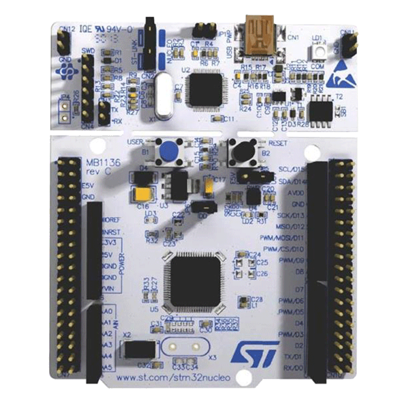
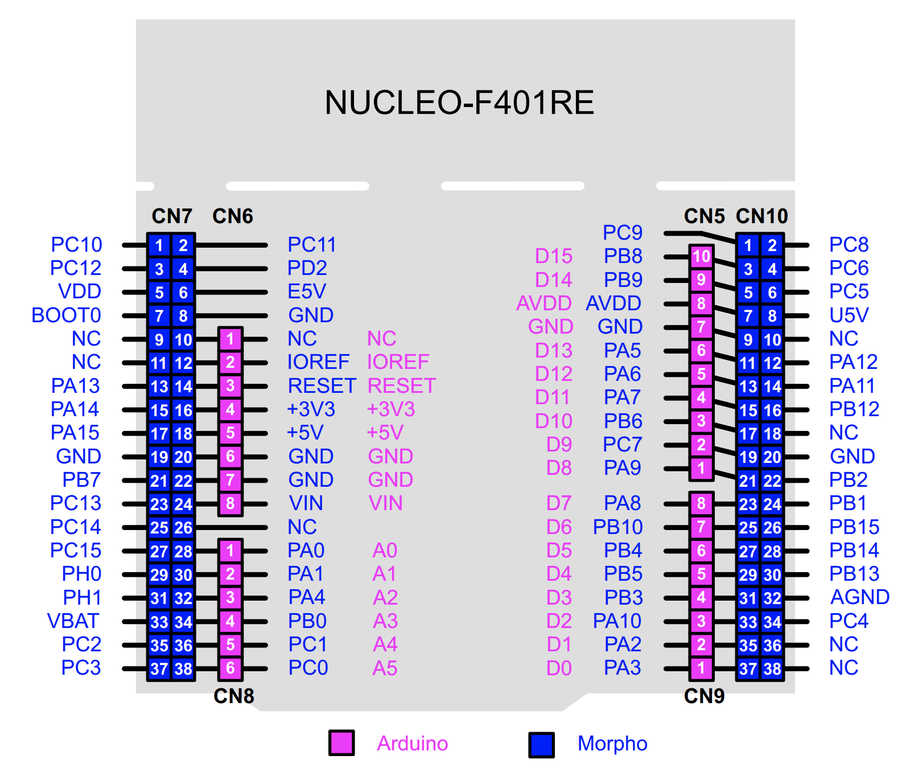
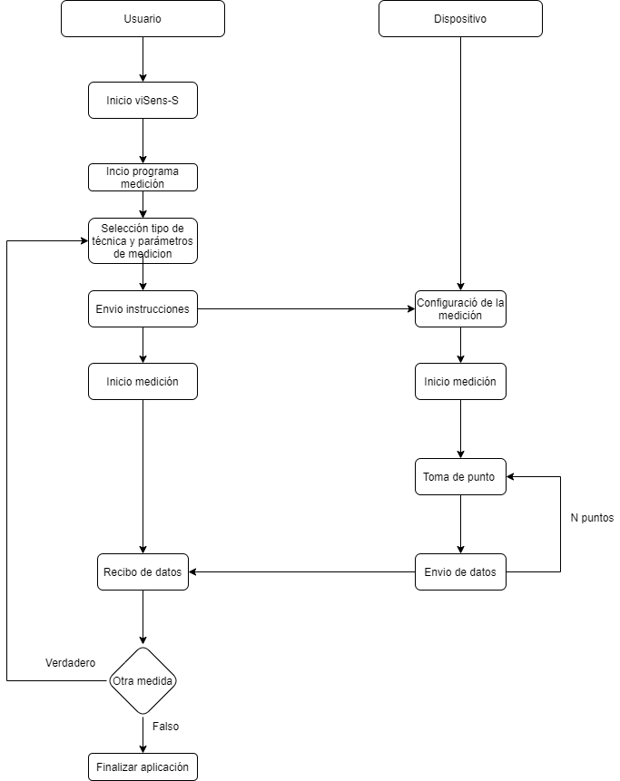
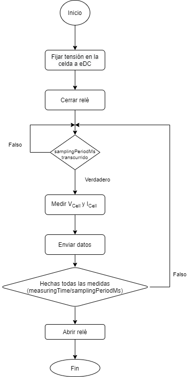

# Proyecto final Microcontroladores - Configuración de un potenciostato

Este proyecto ha sido desarrollado en la asignatura de **Microcontroladores  para Aplicaciones y Sistemas Biomédicos** de Ingeniera Biomédica de la Universidad de Barcelona (UB). Ha sido realizado por el grupo **BlauGrana**,  formado por Julia meca (izquierda) y Raimon Casamitjana (derecha), y con la ayuda de su profesor Albert Álvarez. :yum: 

    
    

> **Figura 1:** Julia Meca (izquierda) y Raimon Casamitjana, autores del proyecto. 

En este documento se encuentran los contenidos necesarios para realizar y entender este proyecto que ha consistido en la configuración de un microcontrolador para realizar pruebas electroquímicas usando un potenciostato.  A partir del trabajo realizado se pueden realizar de forma automatizada cronoamperometías y voltametrías cíclicas.

## Contenidos

- [Introducción](#introducción)
  - [Potenciostato](#potenciostato) 
  - [Cronoamperometría](#cronoamperometría) 
  - [Voltametría cíclica](#voltametría-cíclica) 
- [Objetivos del proyecto](#objetivos-del-proyecto)
- [Software y Hardware](#software-y-hardware)
- [Módulos del front-end](#modulos-del-front--end)
- [Git y GitHub](#git-y-github)
  - [Ramas de desarrollo](#ramas-de-desarrollo)
- [Procedimiento](#procedimiento)
  - [Pinout](#pinout)
  - [Diagramas de flujo](#diagramas-de-flujo)
    - [viSens-S y su comunicación](#viSens-S-y-su-comunicación)
    - [Cronoamperometría](#cronoamperometría)
    - [Voltametría ciclíca](#voltametria-ciclica)
- [Resultados](#resultados)
- [Conclusiones](#conclusiones)
- [Bibliografía](#bibliografía)

## Introducción

Dentro del equipo Blaugrana, Júlia Meca y Raimon Casamitjana han realizado el proyecto documentado en este report. Este se encuentra desarrollado en el marco del último curso de Ingeniería Biomédica, en la asignatura de Microcontroladores para aplicaciones y Sistemas Biomédicos. En pocas palabras, el proyecto se basa en la programación de un potenciostato. Más específicamente, este está formado por un *front-end* propiamente diseñado para su uso en el proyecto, así como un *back-end* compuesto por la placa de evaluación NUCLEO-F410RE de STMelectronics. 

### Potenciostato

El potenciostato es un instrumento muy usado en experimentos electroquímicos tales como potenciometrías, un método analítico que mide la diferencia de potencial entre electrodos sumergidos en una solución. En estos experimentos, se requiere una fuente de diferencia de potencial constante: el potenciostato, el cual controla el voltaje en uno o más **electrodos de trabajo** con ayuda de un **electrodo de referencia** y un **electrodo auxiliar.**

Los electrodos deben estar en contacto directo con la sustancia a analizar pero no deben interferir en el proceso químico, ya que si no, el examen no sería válido. Además, el tamaño de los electrodos afecta la cantidad de corriente que los atraviesa así que debe ser diseñado meticulosamente. 

Respecto a su funcionamiento, el potenciostato se encarga de medir y controlar el potencial de la celda electroquímica, detectando los cambios en su resistencia (R) y variando la intensidad de la corriente administrada (I) al sistema de acuerdo con estas fluctuaciones, consiguiendo que la diferencia de potencial se mantenga constante. 

### Cronoamperometría

La cronoamperometría (CA) es un tipo de medición electroquímica. Se basa en someter a un electrodo de trabajo a un cambio de potencial instantáneo comúnmente mediante una señal escalón. De esta forma, se puede estudiar la respuesta de la corriente o intensidad de la celda electroquímica durante el tiempo. 

Esta técnica es usada de forma habitual para la obtención de una actividad determinada de una especie biológica dada la cuantificación de un analito de interés en forma de una señal de intensidad. **ACABAR TMB**

### Voltamperometría cíclica

La voltamperometría es una técnica electroquímica consiste en aplicar un potencial eléctrico a un electrodo de trabajo, el cual se encuentra sumergido en una disolución que contiene una especie electroactiva y se mide la intensidad de corriente (I) que circula por dicho electrodo. 

La voltamperometria ciclica, en cambio, se utiliza para estudiar mecanismos de reacción como los procesos redox. La variación de potencial en un electrodo estacionario es provocada por una señal de forma triangular que se invierte y vuelve a su valor original, dando lugar a la forma típica de la VC:

fotooooooo

**ACABAR, m’ha fet mandra sorry**

## Objetivos

El objetivo del proyecto es la obtención de medidas de concentración en muestras de **ferricianuro de potasio** a diferentes concentraciones de un buffer de **cloruro de potasio**. Os hemos dejado ciertos links para poder profundizar en estos compuestos químicos. Estas mediciones electroquímicas están basadas en los 2 tipos previamente descritos: la cronoamperometría y la voltametría cíclica. 

Por lo tanto, los objetivos se pueden resumir en los siguientes puntos: 

- Programar un potenciostato mediante la placa STM-32 Núcleo 64.

- Realizar una medición mediante una voltametría cíclica.
- Realizar una medición mediante una cronoamperometría. 
- Controlar la unidad de alimentación, *power management unit* (PMU) del módulo del *front-end.* 
- Comunicarse con la aplicación **viSens-S** mediante el protocolo **MASB-COMM-S**.

Además, ciertos requerimientos específicos tienen que ser cumplidos para la correcta implementación. Por lo que corresponde a la PMU, esta debe ser iniciada al inicio de la medición y no volverse a deshabilitar. Por otra parte, la comunicación debe ser realizada con el host mediante una **comunicación asíncrona con configuración 115200 8N1**. Los tipos de configuración así como sus parámetros y significado, se pueden encontrar en este enlace. La codificación de la información debe también ser realizada en **COBS**, donde el carácter 0x00 implica la finalización del mensaje a enviar. Por lo que corresponde al microcontrolador y su función, este debe actuar de esclavo del master, y atender a las instrucciones sobre las mediciones a realizar reflejados en el protocolo MASB-COMM-S. También, en el momento en el que se envíe la instrucción correspondiente, el microcontrolador debe iniciar la medición. 

Otro aspecto a tener en cuenta hace referencia a cuando una medición no se este realizando. En ese caso, el relé del circuito del *front-end* que conecta al *Counter Electrode* (CE) debe quedar abierto. 

En cuanto a la programación en el entorno de STM en específico, esta se ha realizado de tal forma para que 2 funciones setup y loop sean creadas con el objetivo de simplificar el código y así liberar el fichero principal de ejecución `main.c`

## Software y hardware

Como bien se ha comentado en secciones anteriores, el proyecto está basado en un *front-end* de medición así como el *back-end* de control. Por esta razón, tanto hardware como software son vitales para el desarrollo del proyecto y su adecuada programación. 

Por lo que respecta al microcontrolador, su programación es de crucial importancia dado su papel imprescindible en la comunicación y control del potenciostato así como para la recepción de instrucciones de medición, datos y su pertinente envío. La placa STM32F4021 Núcleo-64 ha sido la usada para este proyecto, por lo que su programación ha sido también realizada con su software pertinente en lenguaje C: **STM32CubeIDE.** 

La placa STM tiene incorporados ciertos periféricos, los cuales han sido usados para la realización de este proyecto. Son el caso del periférico `USART`, para la comunicación con el *host* (la aplicación *viSens-S*), y de I2C para la comunicación con el DAC del *front-end* a la hora de establecer su tensión de salida y polarizar la celda. También cabe destacar el uso de salidas digitales para abrir/cerrar el relé así como para activar la PMU. Finalmente, el uso del ADC del microcontrolador toma un papel protagonista a la hora de leer la tensión y determinar la corriente de la celda. 

El proyecto también gira alrededor de la aplicación de escritorio *viSens-S* (que se puede encontrar en este enlace). Su función es la de enviar las instrucciones pertinentes para realizar las medidas, así como el recibo de los datos y su correspondiente visualización. Aquí podéis encontrar un vídeo en el que se muestra la aplicación en más en detalle. Ya que las pruebas no se han podido realizar de forma directa en la celda, el uso de un potenciómetro en la placa ha sido clave para poder determinar el correcto funcionamiento de la comunicación implementada y la toma de medidas. Mediante su divisor de tensión y la conexión de su terminal variable a la entrada analógica del microcontrolador, se ha podido ir comprobando el correcto funcionamiento del sistema. 

## Módulos del *front-end*

En esta sección se explica en más detalle los componentes del *front-end* del potenciostato controlado por el microcontrolador y su función. Esto es esencial para poder implementar de forma detallada la programación, y tener en cuenta algunas de las fórmulas para ciertas variables de los prototipos usados. 

* **Power Management Unit (PMU)**

## Git y GitHub

Para realizar proyectos basados en el desarrollo de código en equipo, existen dos herramientas muy útiles: Git y GitHub. **Git** es un sistema de control de versiones (VCS) mientras que **GitHub** es un sitio web que proporciona una infraestructura al servidor Git y da alojamiento a todos sus repositorios, así como diferentes herramientas para trabajar con ellos. 

Un sistema de control de versiones es una herramienta que nos permite colaborar con otros desarrolladores o usuarios de un proyecto sin peligro de que sobrescriban el trabajo de los demás. Además, nos permite volver a versiones anteriores del código ya que, como hemos dicho, no se sobrescriben una vez guardadas. 

### Ramas de desarrollo

Para trabajar de forma más organizada y no sobrescribir los archivos, es común crear versiones separadas del código (llamadas **ramas** en Git) y después fusionarla con la versión **maestra** cuando hayamos terminado de editarla. Si observamos la siguiente imagen, los nuevos cambios se probarían en las ramas `feature`y, una vez confirmada su validez, serían añadidos a la rama `develop` y, finalmente, a la rama `master`. 

    
> **Figura 3:** Ejemplo de ramas de desarrollo en un proyecto de Git. 

Una opción comúnmente escogida, es que cada desarrollador cree su propia rama y edite el proyecto general desde esta. En el caso de nuestro proyecto, las distintas ramas han sido creadas según su funcionalidad, es decir, se creó una rama para la cronoamperometría, una rama para la voltametría cíclica, una rama para la comunicación ADC, etc. A continuación, vamos a proceder a describir cada una de estas ramas: 

* **Master:** en esta rama encontraremos, al finalizar el proyecto, el código a entregar. Es decir, que hasta el último, las ramas `feature` y `develop` no vas a ser fusionadas con la rama `master`. 
* **Develop:** a medida que las ramas `feature`, en las que iremos testeando las distintas medidas electroquímicas y comunicaciones de nuestro proyecto, vayan funcionando de manera exitosa, las iremos fusionando con la rama `develop` para integrarlas en el proyecto. Solo en el paso final, serán volcadas a la rama `master`. 
* **Feature/adc:** en esta rama se configura el reloj y toda la comunicación Analógica a Digital. En estos archivos deben incorporarse todas las `librerías HAL`.
* **Feature/chronoamperometry:** esta rama contiene toda la programación de la cronoamperometría, en la que se fija una tensión constante de la celda electroquímica durante un tiempo determinado (posar la variable) y se toman las muestras. 
* **Feature/dac:** en esta rama, debemos configurar el DAC (*Digital to Analog Converter*) `MCP4725` mediante la dirección del dispositivo y la del esclavo, la tensión de referencia, el voltaje deseado, etc.
* **Feature/stm32main:** esta rama corresponde a la operativa del microcontrolador, es decir, donde se llaman a todas las funciones (la cronoamperometría, la voltametría cíclica, las comunicaciones, etc.) para ejecutar el programa completo. Así, en esta rama, podemos encontrar las funciones “setup” y “loop” para que ejecuten las medidas de manera indefinida siempre y cuando se cumplan las condiciones preestablecidas. 
* **Feature/prova:** finalmente, en esta rama hemos volcado todo el código para hacer tests antes de hacer el *Pull Request* en la rama `develop`. Ha sido otra rama de seguridad previa a la `master`.

## Procedimiento

En esta sección hablaremos sobre el funcionamiento de los programas (la cronoamperometría, la voltametría cíclica, las comunicaciones, etc.) así como sus diagramas de flujo. 

Aún así, antes de ello, hablaremos de cómo conectar el potenciostato a la placa (el **pinout**), de cuáles son estos pines usados por el microcontrolador (*PA0, PA1, PB8...*) para el control del potenciostato, así como su tipología y descripción.

### Pinout de la STM32 Núcleo 64

    
    

> ​    **Figura 4**: STM-32 Núcleo 64 (izquierda) y sus entradas y salidas o *pinout* (derecha).

Como se puede observar en la imagen, hay muchos pines disponibles en esta placa de evaluación pero no todos ellos son necesarios para el uso del potenciostato. Este dispositivo consta de cinco cables que deberos conectar a 5 pines de la placa. Estos son los pines analógicos de la placa **A0** y **A1**; los pines que permiten la comunicación I2C (**SCL** y **SDA**), el pin de salida digital **D4** y; por último, el pin **SCK**. 

* Los pines analógicos se utilizan para medir las **tensiones de la celda electroquímica**. Por un lado, el pin PA0 se usa para medir la tensión de referencia de la celda electroquímica (**VREF**), usada para medir VCELL. Y, por otro lado, el pin PA1 representa la tensión de salida del TIA, el cual se usa para medir **ICELL**.
* Los pines PB8 y PB9 se encarga las señales *Serial Data* (SDA) y *Serial Clock* (SCK) , para comunicar el maestro con el esclavo mediante I2C.
* El pin PA5 representa el estado de la PMU, siendo `0`: deshabilitada y`1`:  habilitada.
* Finalmente, el pin PB5 representa el control del relé (el cual deja pasar, o no, la corriente). Por lo tanto puede estar abierto (`0`) o cerrado (`1`).

### Diagramas de flujo

A continuación, en esta sección, se especificará el flujo de trabajo seguido para la implementación final de la aplicación y realización de los objetivos previamente definidos. 

Antes de explicar el funcionamiento del programa y para facilitar el entendimiento de los siguientes diagramas, vamos a hacer un glosario de todos los archivos existentes en `masb-pot-s-firmware`:

* En la carpeta `Core/Inc` encontraremos el *header file* `main.h` (entre otros) y dentro de la carpeta `Inc/components`, usaremos los siguientes archivos: 
  * `ad5280_driver.h`
  * `adc.h`
  * `chronoamperometry.h`
  * `cyclic_voltammetry.h`
  * `dac.h`
  * `cobs.h`
  * `formulas.h`
  * `i2c_lib.h`
  * `masb_comm_s.h`
  * `mcp4725_driver.h`
  * `stm32main.h`
* En la carpeta `Core/Src` encontraremos el *source file* `main.c` (entre otros) y dentro de la carpeta `Src/components`, usaremos los siguientes archivos: 
  * `ad5280_driver.c`
  * `adc.c`
  * `chronoamperometry.c`
  * `cyclic_voltammetry.c`
  * `dac.c`
  * `cobs.c`
  * `formulas.c`
  * `i2c_lib.c`
  * `masb_comm_s.c`
  * `mcp4725_driver.c`
  * `stm32main.c`

Ahora sí, vamos a ver la descripción del programa! :smile:

#### viSens-S y su comunicación

En referencia a la aplicación de escritorio así como el envío inicial de instrucciones y medidas tomadas, su diagrama es representado a continuación:

    

> **Figura 5:** Diagrama de flujo de ...

Para la implementación del flujo de trabajo representado, la comunicación asíncrona mediante **USART** así como la codificación **COBS** y el protocolo MASB-COMM-S entre el dispositivo y la aplicación de escritorio es esencial. Por esta razón, los archivos `cobs.c` y `masb_comm_s.c` realizan esta función. El primero se encarga de la codificación/decodificación de la información, mientras que el segundo, por su lado, configura la comunicación asíncrona, el recibimiento/lectura de instrucciones de medición para almacenar sus parámetros en las debidas estructuras (mediante uniones), así como la transmisión de los datos sensados. Cabe destacar que estas funcionalidades ya se encontraban hechas en prácticas anteriores de la asignatura. La toma de medidas dependiendo de su técnica será expuesta de forma detallada a continuación. 

#### Cronoamperometría

De forma general, la funcionalidad de la cronoamperometría puede ser representada de la siguiente forma: 

    

> **Figura 5:** Diagrama de flujo de la Cronoamperometría (CA).

Diferentes ficheros han sido necesarios para implementar el proceso de medición mediante cronoamperometría, ahora vamos a detallar cada uno de ellos. Cabe destacar que muchos de los ficheros que se comentan en este apartado serán usados más adelante también. Por poner un ejemplo: la implementación del ADC tendrá que ser llamada tanto desde la cronoamperometría como desde la voltametría cíclica, evidentemente :open_mouth:. Así pues, vamos a ver cuáles son estos ficheros que componen la CA:

* `chronoamperometry`: En este fichero se encuentra reflejado, en primer lugar, la obtención de las instrucciones de la medición: voltaje a fijar (`eDC`), el `sampling period`, así como el tiempo total de la medida. También se cierra el relé y se configura el *timer* con el *sampling period* determinado (la función **ClockSettings**, se encuentra definida en otro fichero que comentaremos a continuación). Además, se calculan el número de muestras a realizar, dados el tiempo de la medida y el *sampling period*. De esta forma, iniciamos un bucle con un contador. Se establece una variable "estado" que define qué esta midiendo el sensor, en este caso, se encuentra haciendo una cronoamperometría así que marcará `estado = CA`. Posteriormente veremos que esto es usado por el *timer*. Finalmente, al acabar la medida el relé se abre.

* `adc`: este fichero tiene dos funciones principales, la propia **conversión ADC** para la medición, y la **configuración del *timer*** para que la interrupción se dé según la frecuencia enviada por el usuario. Estas funcionalidades son llamadas y usadas tanto en la cronoamperometría como en la voltametría cíclica. 
  * `ADC_measure()`: esta función es la encargada de inicializar el ADC para la medición de 